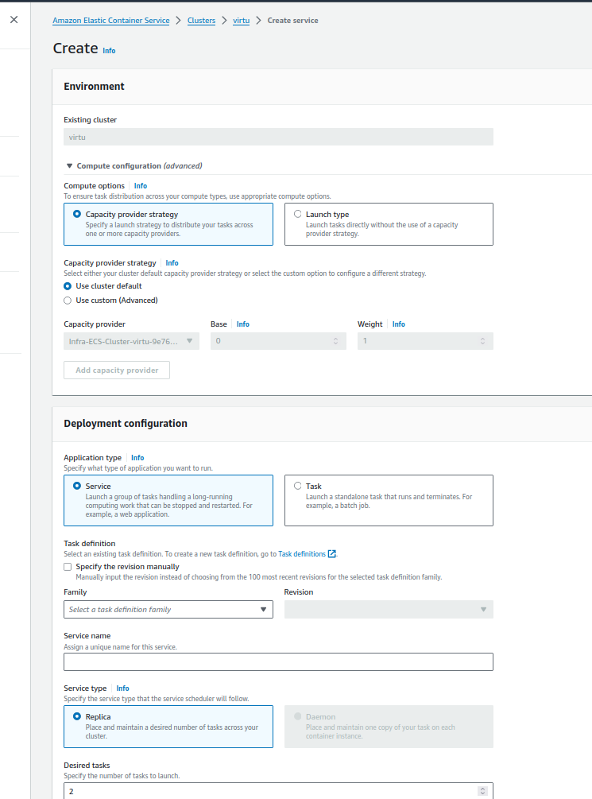

Pour réaliser ces travaux pratiques, nous allons procéder étape par étape. Voici un guide détaillé pour vous aider à créer une image Docker d'une application Web, à la déployer dans une registry publique, et ensuite à la déployer dans AWS ECS avec un Load Balancer (ALB) et finalement utiliser ECS Fargate. 

### TP1 - Création et déploiement de l'image Docker

#### 1. Choix de la plateforme technologique
Pour ce guide, nous allons utiliser une application Node.js simple. Vous pouvez choisir n'importe quelle autre plateforme (Python, Java, etc.) si vous préférez.

#### 2. Créer une application Node.js simple

1. Créez un dossier pour votre application, puis naviguez dedans.
    ```bash
    mkdir my-node-app
    cd my-node-app
    ```

2. Initialisez un projet Node.js.
    ```bash
    npm init -y
    ```

3. Installez Express.js.
    ```bash
    npm install express
    ```

4. Créez un fichier `app.js` avec le contenu suivant :
    ```javascript
    const express = require('express');
    const app = express();
    const port = 3000;

    app.get('/', (req, res) => {
      res.send('Hello World!');
    });

    app.listen(port, () => {
      console.log(`Example app listening at http://localhost:${port}`);
    });
    ```

5. Testez votre application en exécutant :
    ```bash
    node app.js
    ```

#### 3. Créer un fichier Dockerfile
Dans le même dossier, créez un fichier nommé `Dockerfile` avec le contenu suivant :
```Dockerfile
# Utiliser l'image officielle de Node.js
FROM node:14

# Créer et utiliser le répertoire de l'application
WORKDIR /usr/src/app

# Copier les fichiers package.json et package-lock.json
COPY package*.json ./

# Installer les dépendances
RUN npm install

# Copier le reste des fichiers de l'application
COPY . .

# Exposer le port de l'application
EXPOSE 3000

# Démarrer l'application
CMD ["node", "app.js"]
```

#### 4. Construire l'image Docker
Exécutez la commande suivante pour construire votre image Docker :
```bash
docker build -t my-node-app .
```

#### 5. Tester l'image Docker en local
Exécutez la commande suivante pour tester l'image localement :
```bash
docker run -p 3000:3000 my-node-app
```
Accédez à `http://localhost:3000` pour vérifier que l'application fonctionne.

#### 6. Pousser l'image vers une registry publique
1. Connectez-vous à Docker Hub (ou une autre registry publique).
    ```bash
    docker login
    ```

2. Taggez votre image Docker.
    ```bash
    docker tag my-node-app YOUR_DOCKERHUB_USERNAME/my-node-app
    ```

3. Poussez l'image vers Docker Hub.
    ```bash
    docker push YOUR_DOCKERHUB_USERNAME/my-node-app
    ```

### TP2 - Déploiement dans AWS ECS avec ALB

#### 1. Créer un Cluster ECS

1. **Accéder à la console ECS** :
   - Connectez-vous à votre compte AWS.
   - Allez à la console ECS.

2. **Créer un nouveau cluster** :
   - Cliquez sur "Clusters" dans le menu de navigation.
   - Cliquez sur "Create Cluster".
   - Sélectionnez **"EC2 Linux + Networking"**.
   - Configurez le cluster (nom, VPC, sous-réseaux, etc.).
   - Cliquez sur **"Create"** pour créer le cluster.

<p align="center">  <p>


#### 2. Créer une définition de tâche ECS

1. **Accéder à la console ECS** :
   - Cliquez sur "Task Definitions".
   - Cliquez sur **"Create new Task Definition"**.

2. **Configurer la définition de tâche** :
   - Choisissez **"EC2"** comme type de lancement.
   - Donnez un nom à la définition de tâche.
   - Ajoutez un container :
     - **Image** : votre image Docker (par exemple, `YOUR_DOCKERHUB_USERNAME/my-node-app`).
     - **Port Mappings** : configurez le port (exemple : `3000`).

3. **Configurer les paramètres avancés** :
   - **Network Mode** : `bridge`.
   - **Environment Variables** (si nécessaire).

4. **Créer la définition de tâche** :
   - Cliquez sur **"Create"**.

<p align="center">  <p>


#### 3. Créer un Service ECS

1. **Retourner à la console ECS** :
   - Sélectionnez votre cluster.
   - Cliquez sur **"Create"** sous la section "Services".

2. **Configurer le service** :
   - **Launch Type** : `EC2`.
   - **Task Definition** : sélectionnez celle que vous venez de créer.
   - **Cluster** : sélectionnez votre cluster.
   - **Service Name** : nommez le service.
   - **Number of Tasks** : indiquez le nombre d'instances (par exemple, `2`).
   - **Deployment Type** : `Rolling update`.

3. **Configurer les paramètres de réseau** :
   - **VPC** : sélectionnez le VPC.
   - **Subnets** : choisissez les sous-réseaux appropriés.
   - **Security Groups** : configurez les groupes de sécurité (autorisez le trafic entrant sur le port 3000).

4. **Load Balancing** :
   - Sélectionnez **"Application Load Balancer"**.
   - Configurez le ALB :
     - **Target Group** : créez un nouveau groupe cible.
     - **Health Check Path** : configurez le chemin de vérification de l’état (exemple : `/`).

5. **Finaliser la création** :
   - Cliquez sur **"Next Step"** et vérifiez les configurations.
   - Cliquez sur **"Create Service"**.

<p align="center">  <p>


#### 4. Configurer un Application Load Balancer (ALB)

1. **Accéder à la console EC2** :
   - Sélectionnez **"Load Balancers"** dans le menu.

2. **Créer un ALB** :
   - Cliquez sur **"Create Load Balancer"** et choisissez **"Application Load Balancer"**.
   - Configurez le nom, le schéma et l'IP.

<p align="center">  <p>


3. **Configurer les paramètres du réseau** :
   - **VPC** : sélectionnez le VPC.
   - **Subnets** : sélectionnez les sous-réseaux.

4. **Configurer le groupe de sécurité** :
   - Créez ou sélectionnez un groupe de sécurité permettant le trafic HTTP sur le port 80.

<p align="center">  <p>


5. **Configurer les cibles** :
   - Choisissez le groupe cible créé lors de la création du service ECS.

6. **Finaliser la création** :
   - Cliquez sur **"Create"**.

#### 5. Vérification du déploiement

1. **Vérifiez les cibles** dans le groupe cible du ALB pour vous assurer qu'elles sont en bon état.
2. **Accédez à l’URL du ALB** dans un navigateur pour vérifier que votre application Web fonctionne.

<p align="center">  <p>


Et finalement on a bien l'url  de l'ALB qui fait fonctionner notre application.

<p align="center">  <p>


### Résumé

Ces étapes détaillées devraient vous aider à déployer votre image Docker dans AWS ECS avec un Application Load Balancer, configurant des ports dynamiques et vérifiant le bon fonctionnement de votre service.


### TP3 – Utilisation d’ECS Fargate

<p align="center">  <p>


#### 1. Modifier la définition de tâche pour Fargate

1. **Accéder à la console ECS** :
   - Connectez-vous à votre compte AWS.
   - Allez dans la section **Task Definitions**.

2. **Créer une nouvelle définition de tâche** :
   - Cliquez sur **"Create new Task Definition"**.
   - Choisissez **"Fargate"** comme type de lancement.

3. **Configurer les paramètres de la tâche** :
   - **Nom** : Donnez un nom à votre définition de tâche.
   - **Task Role** : Sélectionnez un rôle IAM (ou créez-en un si nécessaire).
   - **Network Mode** : `awsvpc`.

4. **Ajouter un container** :
   - **Image** : Utilisez l’image Docker de votre application (exemple : `YOUR_DOCKERHUB_USERNAME/my-node-app`).
   - **Port Mappings** : Définissez le port (exemple : `3000`).

5. **Configurer les ressources** :
   - **Task Size** : Choisissez la mémoire et le CPU nécessaires pour l'application.

6. **Créer la définition de tâche** :
   - Cliquez sur **"Create"**.

#### 2. Créer un Service Fargate

1. **Accéder à votre cluster** :
   - Dans la console ECS, sélectionnez votre cluster existant ou créez-en un nouveau pour Fargate.

2. **Créer un service** :
   - Cliquez sur **"Create"** sous la section "Services".

3. **Configurer le service** :
   - **Launch Type** : `Fargate`.
   - **Task Definition** : Sélectionnez celle que vous venez de créer.
   - **Service Name** : Nommez le service.
   - **Number of Tasks** : Indiquez le nombre de containers à exécuter (exemple : `2`).


4. **Configurer le réseau** :
   - **VPC** : Choisissez le VPC.
   - **Subnets** : Sélectionnez les sous-réseaux publics.
   - **Security Groups** : Créez ou sélectionnez un groupe de sécurité (autorisez le trafic entrant sur le port 3000).
<p align="center">  <p>


5. **Configurer le Load Balancer (ALB)** :
   - **Application Load Balancer** : Utilisez le même ALB ou créez-en un nouveau.
   - **Target Group** : Utilisez le groupe cible créé précédemment ou en créez un nouveau.
   - **Health Check Path** : Indiquez le chemin (exemple : `/`).

6. **Configurer les options avancées** (facultatif) :
   - **Auto Scaling** : Configurez l'auto scaling si nécessaire.

7. **Finaliser la création** :
   - Cliquez sur **"Create Service"**.

<p align="center">  <p>


#### 3. Vérification du déploiement

1. **Vérifiez les cibles** dans le groupe cible du ALB pour vous assurer qu'elles sont en bon état.
2. **Accédez à l’URL du ALB** dans un navigateur pour vérifier que votre application Web fonctionne.

<p align="center">  <p>


### Résumé

Avec ces étapes, vous aurez déployé votre application Docker sur ECS Fargate avec un ALB. Cela permet une gestion plus simple sans avoir à vous occuper de l’infrastructure sous-jacente.